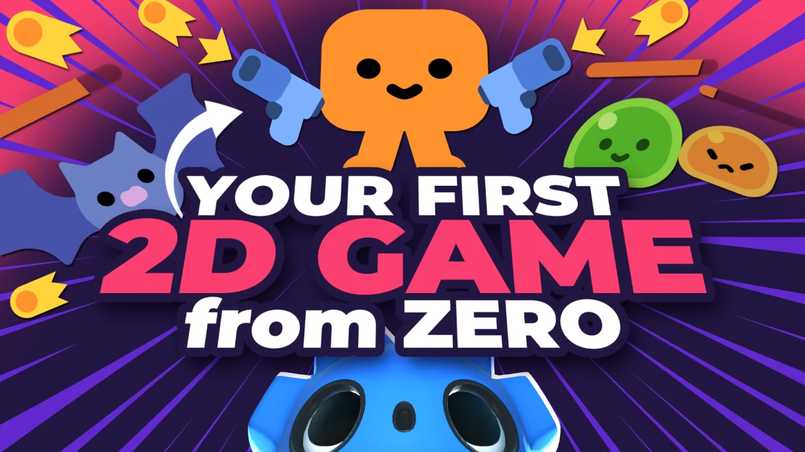

# Godot 2d Vampire Style Game Demo

A simple Vampire style game created by Godot 4.2



This game is learned from the [Create Your First 2D Game From Zero with Godot 4 · GDQuest](https://www.gdquest.com/tutorial/godot/2d/first-2d-game-godot-4/) , the tutorial is made by Nathan Lovato - GDQuest founder. Courteous designer with a taste for Free Software. I promote sharing and collaboration.

## Development Environment

- Godot Engine Mono - v 4.2.1

## How To Open The Project

1. Download Godot Engine from [Godot Engine Official Website](https://godotengine.org/) if you haven't yet
2. clone this project to the directory you want, using

```bash
git clone https://github.com/Kingsmai/godot-simple-vampire-game.git
```

3. Open the project using Godot Engine (Google for it if you don't know how to)
4. Start the game inside the Godot.

## Roadmap

- [ ] Procedural tree spawn
- [ ] Score system
- [ ] Player upgrades
- [ ] More UI

## License

This project is licensed under the [Creative Commons Zero v1.0 Universal License](LICENSE). See the [LICENSE](LICENSE) file for details.